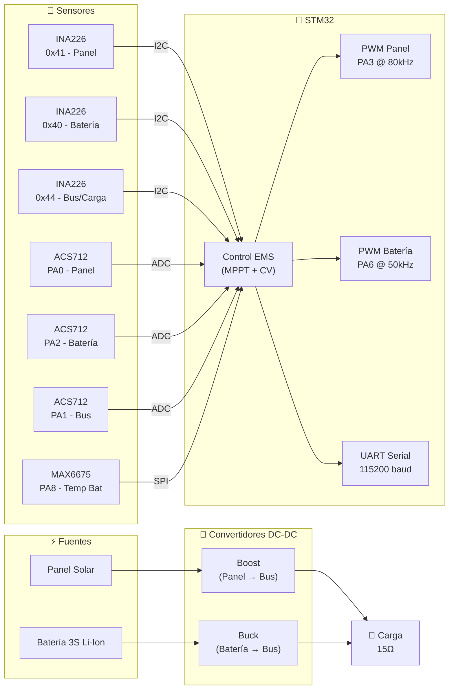
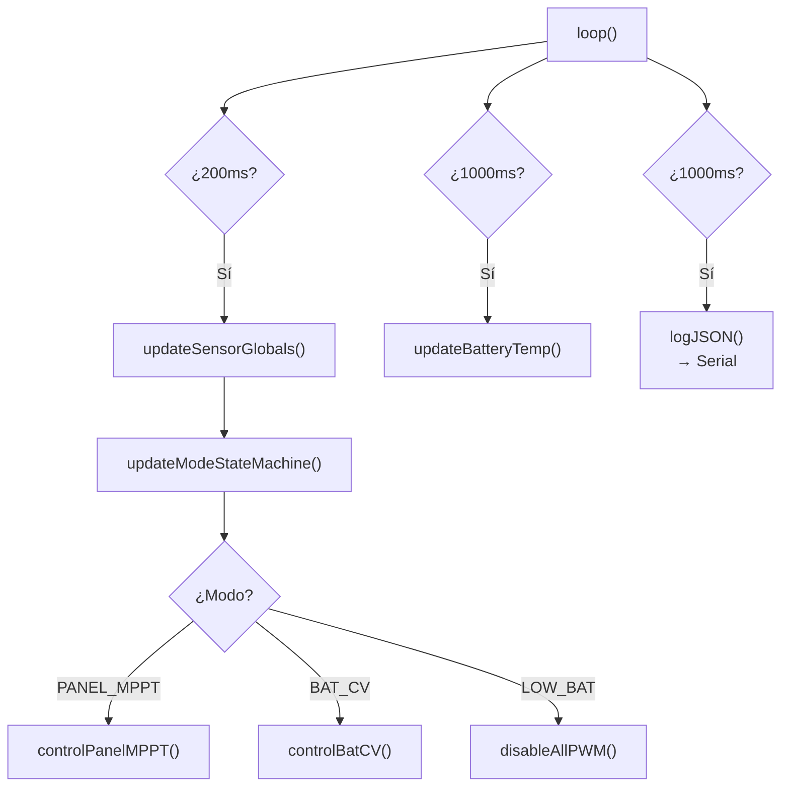

# Firmware EMS — Descripción General

:::tip Código Fuente
[📥 Descargar Firmware de Ejemplo (ems_firmware.ino)](/firmware/ems_firmware.ino)
:::

El firmware del sistema EMS se ejecuta en un microcontrolador **STM32** (serie Blue Pill / STM32F103) y es responsable de:

1. **Leer sensores** de voltaje, corriente y temperatura.
2. **Ejecutar algoritmos de control** (MPPT y regulación CV).
3. **Transmitir telemetría** en formato JSON por el puerto serial.

## Diagrama de Bloques del Hardware



## Sensores y Comunicación

### INA226 — Voltaje (I2C)

Los módulos **INA226** miden el voltaje del bus mediante el registro `0x02` con resolución de **1.25 mV/LSB**.

| Dirección I2C | Nodo | Corrección |
|--------------|------|------------|
| `0x41` | Panel Solar | `+0.6V` si `measured > 0.6V` |
| `0x40` | Batería | Sin corrección |
| `0x44` | Bus DC / Carga | `+0.6V` si `measured > 0.6V` |

```cpp
float readVoltageCorrected(uint8_t addr) {
    float measured = readVoltageRaw(addr);

    if (addr == INA_BAT_ADDR) return measured;

    if (addr == INA_PANEL_ADDR || addr == INA_BUS_ADDR) {
        if (measured <= 0.6f) return 0.0f;
        return measured + 0.6f;
    }
    return measured;
}
```

:::info Offset de 0.6V
La corrección se aplica para compensar la caída de tensión del diodo de protección en las líneas de panel y carga. La batería tiene conexión directa.
:::

### ACS712 — Corriente (ADC)

Los sensores de efecto Hall **ACS712** proporcionan una señal analógica proporcional a la corriente. Se leen mediante el ADC de 12 bits del STM32 con promediado de 16 muestras.

```cpp
#define ACS_SAMPLES     16
#define ADC_RESOLUTION  4095.0f
#define VREF            3.3f
#define ACS_SENS_ADC    0.178f    // Sensibilidad (V/A)

float acsOffsetVoltage[3] = {
    2.3336f,  // Panel
    2.3467f,  // Bus/Carga
    2.3651f   // Batería
};

float readCurrentACS(uint8_t index) {
    uint16_t raw = readADCRaw(acsPins[index]);
    float voltage = (raw / ADC_RESOLUTION) * VREF;
    return (voltage - acsOffsetVoltage[index]) / ACS_SENS_ADC;
}
```

:::warning Calibración
Los valores de `acsOffsetVoltage` deben **recalibrarse** si se cambia de placa o de sensor. Para calibrar, se debe desconectar la corriente y registrar el voltaje de salida del ACS712 en reposo.
:::

### MAX6675 — Temperatura (SPI)

El termopar tipo K con el convertidor **MAX6675** mide la temperatura de la batería vía SPI con resolución de **0.25°C**.

| Pin STM32 | Función MAX6675 |
|-----------|----------------|
| `PA8` | CS (Chip Select) |
| `PB13` | SCK |
| `PB14` | MISO (datos) |
| `PB15` | MOSI (no usado) |

```cpp
float readMAX6675C(uint8_t csPin) {
    uint16_t raw = 0;

    SPI.beginTransaction(SPISettings(1000000, MSBFIRST, SPI_MODE0));
    digitalWrite(csPin, LOW);
    delayMicroseconds(5);
    raw = SPI.transfer16(0x0000);
    digitalWrite(csPin, HIGH);
    SPI.endTransaction();

    // Bit D2 = 1 → termocupla desconectada
    if (raw & 0x0004) return NAN;

    raw >>= 3;
    return raw * 0.25f;
}
```

## Pinout Completo

| Pin STM32 | Función | Notas |
|-----------|---------|-------|
| `PA0` | ADC - Corriente Panel (ACS712) | `INPUT_ANALOG` |
| `PA1` | ADC - Corriente Bus (ACS712) | `INPUT_ANALOG` |
| `PA2` | ADC - Corriente Batería (ACS712) | `INPUT_ANALOG` |
| `PA3` | PWM Panel (TIM2_CH4) | 80 kHz |
| `PA6` | PWM Batería (analogWrite) | 50 kHz |
| `PA8` | SPI CS - MAX6675 | `OUTPUT` |
| `PB6/PB7` | I2C (SCL/SDA) - INA226 ×3 | 100 kHz |
| `PB13` | SPI SCK - MAX6675 | |
| `PB14` | SPI MISO - MAX6675 | |

## Bucle Principal

El firmware ejecuta un `loop()` con tres tareas periódicas:



| Tarea | Periodo | Función |
|-------|---------|---------|
| Lectura de sensores + control | 200 ms | `updateSensorGlobals()` + máquina de estados |
| Lectura de temperatura | 1000 ms | `updateBatteryTemp()` |
| Transmisión JSON | 1000 ms | `logJSON()` → Serial |
