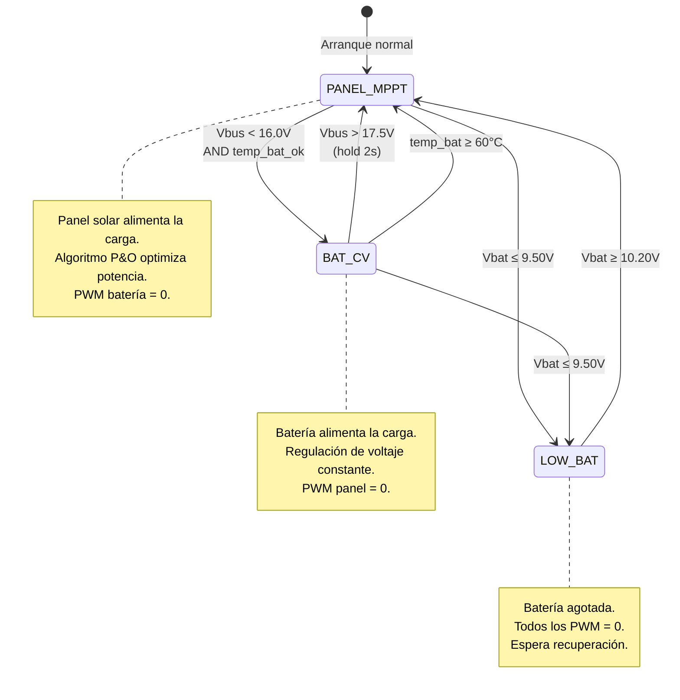
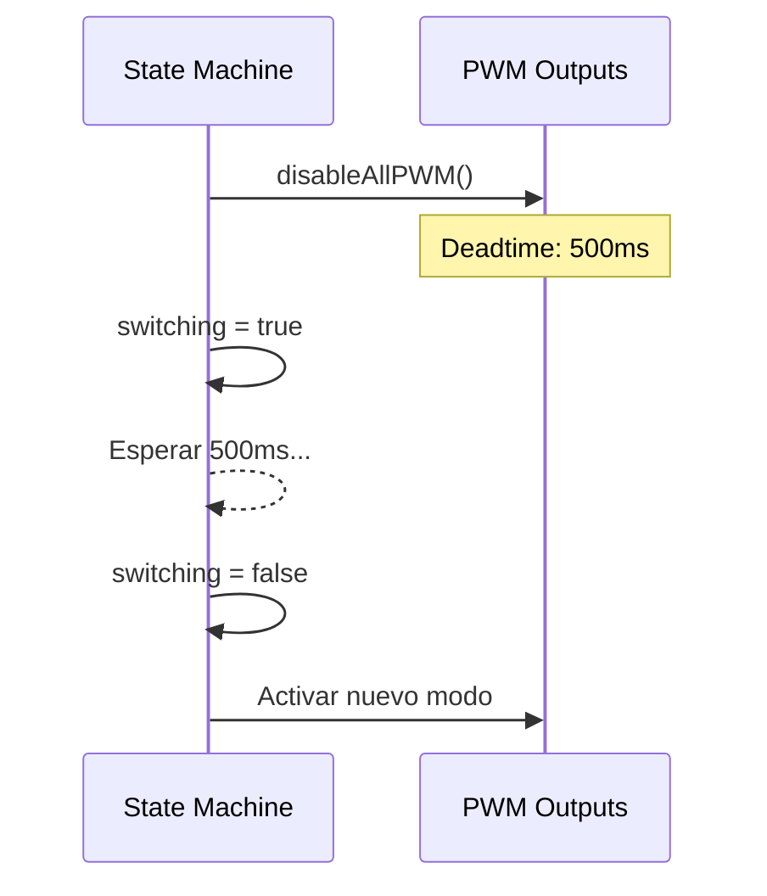
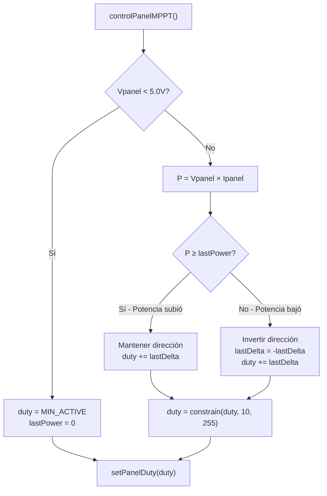
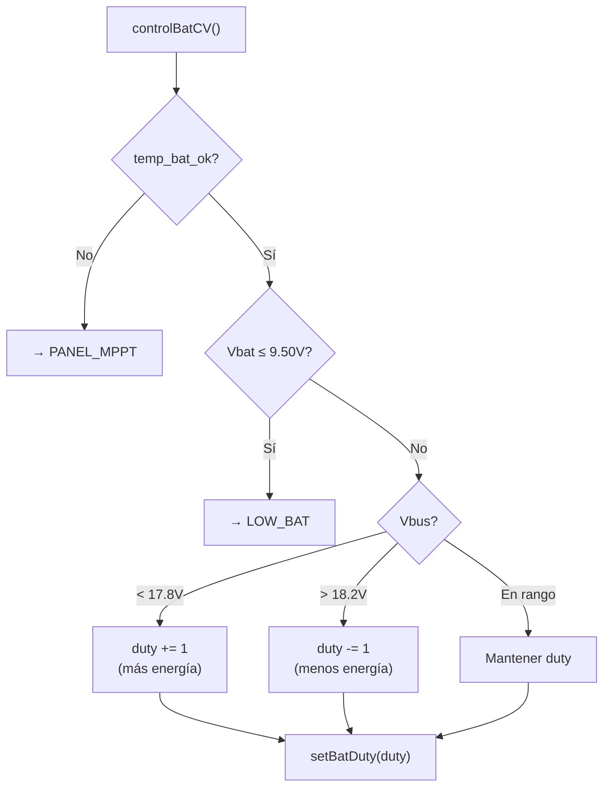
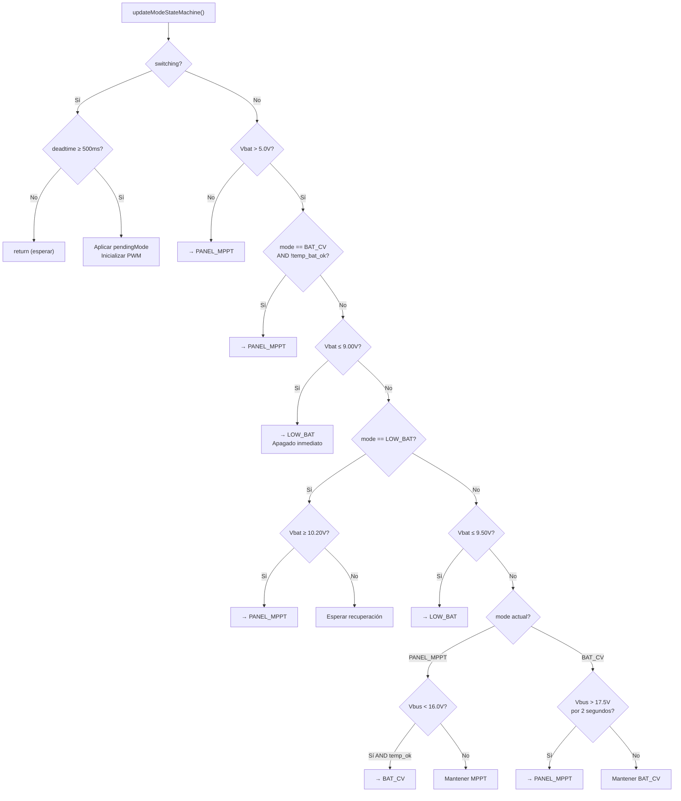

# Máquina de Estados y Algoritmos de Control

El firmware implementa una **máquina de estados finita** con tres modos de operación, gestionada por la función `updateModeStateMachine()`.

## Diagrama General de la Máquina de Estados



## Modos de Operación

### `MODE_PANEL_MPPT` — Panel Solar como Fuente Principal

En este modo, el convertidor Boost del panel está activo y ejecuta el algoritmo **MPPT (Maximum Power Point Tracking)** para extraer la máxima potencia del panel fotovoltaico.

- **PWM Panel:** Activo (controlado por P&O)
- **PWM Batería:** Desactivado (duty = 0)
- **Condición de salida:** El voltaje del bus cae por debajo de `VBUS_TO_BAT` (16.0V), indicando que el panel no puede sostener la carga.

### `MODE_BAT_CV` — Batería como Respaldo

Cuando el panel no puede abastecer la demanda, la batería entra como fuente de respaldo. El convertidor Buck mantiene el voltaje del bus en la ventana de **voltaje constante** (17.8V–18.2V).

- **PWM Panel:** Desactivado (duty = 0)
- **PWM Batería:** Activo (regulación CV)
- **Condición de salida:** El voltaje del bus supera `VBUS_TO_PANEL` (17.5V) durante al menos 2 segundos, **O** la temperatura de la batería excede 60°C.

### `MODE_LOW_BAT` — Batería Agotada

Estado de protección. Todos los PWM están desactivados hasta que la batería se recupere por encima de `VBAT_RECOVER` (10.20V).

---

## Tiempo Muerto (Deadtime)

Cada transición entre modos pasa por un **deadtime de 500ms** donde ambos PWM están desactivados para prevenir cortocircuitos entre fuentes:



```cpp
static inline void beginSwitchTo(Mode next) {
    switching = true;
    pendingMode = next;
    switchStartMs = millis();
    disableAllPWM();           // Apagar TODO
    vbusAboveSinceMs = 0;
}
```

---

## Algoritmo MPPT: Perturbar y Observar (P&O)

El algoritmo P&O busca el **punto de máxima potencia** del panel solar perturbando el duty cycle del PWM y observando si la potencia aumenta o disminuye.

### Diagrama de Flujo



### Código del Algoritmo

```cpp
void controlPanelMPPT() {
    float vpanel = volt_panel_filt;
    float ipanel = amp_panel_filt;

    // Limitar tasa de cambio a 20 steps/segundo
    unsigned long now = millis();
    unsigned long minTimeBetween = 1000UL / PWM_MAX_CHANGE_PER_SEC;
    if (now - lastPwmChangeMs < minTimeBetween) {
        setPanelDuty(panelDuty);
        return;
    }

    int oldDuty = panelDuty;

    if (vpanel < PANEL_MIN_VOLTAGE) {
        // Panel sin suficiente voltaje → duty mínimo
        panelDuty = PANEL_PWM_MIN_ACTIVE;
        lastPower = 0.0f;
    } else {
        float power = vpanel * ipanel;

        // Perturbar y Observar
        if (power >= lastPower)
            panelDuty += lastDelta;    // Misma dirección
        else {
            lastDelta = -lastDelta;     // Invertir
            panelDuty += lastDelta;
        }

        lastPower = power;
    }

    panelDuty = constrain(panelDuty, PANEL_PWM_MIN_ACTIVE, PWM_MAX);
    if (panelDuty != oldDuty) lastPwmChangeMs = now;
    setPanelDuty(panelDuty);
}
```

:::info Tasa de Convergencia
El paso del MPPT es de **1 unidad de duty** cada **50ms** (máximo 20 cambios/segundo). Esto permite convergencia suave sin oscilaciones bruscas que dañen los componentes.
:::

---

## Regulación CV de Batería

El control de voltaje constante ajusta el duty cycle del convertidor Buck para mantener el voltaje del bus dentro de la ventana `[17.8V, 18.2V]`:



```cpp
void controlBatCV() {
    float vbus = volt_bus_filt;

    if (!temp_bat_ok) {
        beginSwitchTo(MODE_PANEL_MPPT);
        return;
    }

    if (vbus < VBUS_CV_LOW)       batDuty += PWM_STEP;  // Subir
    else if (vbus > VBUS_CV_HIGH) batDuty -= PWM_STEP;  // Bajar

    batDuty = constrain(batDuty, BAT_PWM_MIN_ACTIVE, PWM_MAX);
    setBatDuty(batDuty);
}
```

---

## Lógica Completa de `updateModeStateMachine()`



Esta función se ejecuta cada **200ms** y evalúa, en orden de prioridad:

1. **Deadtime activo** → Esperar.
2. **Batería ausente** → Forzar panel.
3. **Sobretemperatura** → Salir de batería.
4. **Voltaje crítico** → Apagado de emergencia.
5. **Bajo voltaje** → Modo LOW_BAT.
6. **Conmutación por bus** → Cambiar entre MPPT y CV según el voltaje del bus.
