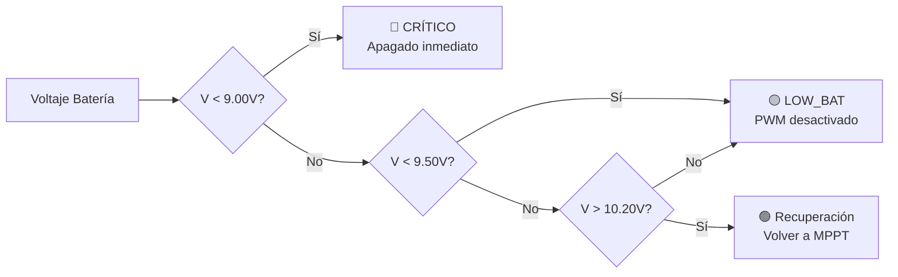
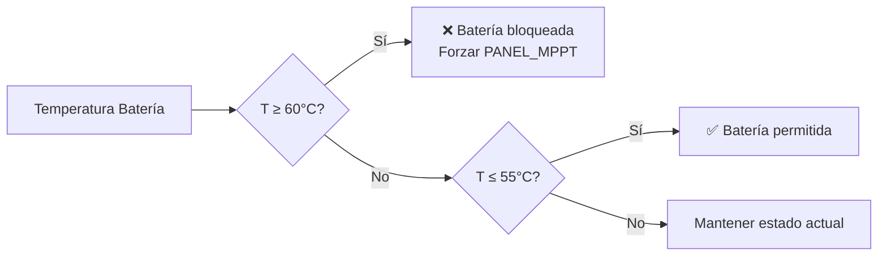

# Parámetros de Configuración del Firmware

Todos los umbrales y constantes del firmware se definen como `#define` al inicio del archivo `.ino`. Esta sección documenta cada parámetro para facilitar su modificación.

## Tabla Resumen de Parámetros

| Parámetro | Valor | Unidad | Descripción |
|-----------|-------|--------|-------------|
| `PANEL_PWM_FREQ` | 80000 | Hz | Frecuencia del PWM del convertidor del panel |
| `BAT_PWM_FREQ` | 50000 | Hz | Frecuencia del PWM del convertidor de batería |
| `CONTROL_PERIOD_MS` | 200 | ms | Periodo del bucle de control |
| `LOG_PERIOD_MS` | 1000 | ms | Periodo de transmisión serial |
| `PWM_MAX_CHANGE_PER_SEC` | 20 | steps/s | Tasa máxima de cambio de duty cycle |
| `PANEL_MIN_VOLTAGE` | 5.0 | V | Voltaje mínimo para activar MPPT |
| `VBUS_CV_LOW` | 17.8 | V | Setpoint inferior de voltaje constante |
| `VBUS_CV_HIGH` | 18.2 | V | Setpoint superior de voltaje constante |
| `VBUS_TO_BAT` | 16.0 | V | Umbral para conmutar a batería |
| `VBUS_TO_PANEL` | 17.5 | V | Umbral para volver a panel |
| `VBAT_UNDERVOLTAGE` | 9.50 | V | Protección por bajo voltaje de batería |
| `VBAT_RECOVER` | 10.20 | V | Voltaje de recuperación |
| `VBAT_CRITICAL` | 9.00 | V | Voltaje crítico (apagado inmediato) |
| `TEMP_BAT_MAX_C` | 60.0 | °C | Temperatura máxima de batería |
| `TEMP_BAT_RECOVER_C` | 55.0 | °C | Temperatura de recuperación (histéresis) |

---

## Protección de Batería

```cpp
/* ===================== Protección batería 3S ===================== */
#define VBAT_UNDERVOLTAGE       9.50f   // Entra en MODE_LOW_BAT
#define VBAT_RECOVER            10.20f  // Sale de MODE_LOW_BAT
#define VBAT_CRITICAL           9.00f   // Apagado de emergencia
#define VBAT_PRESENT_MIN        5.0f    // Voltaje mínimo para detectar batería
```



:::danger Batería 3S
Los valores están calibrados para una batería **3S Li-Ion** (rango nominal 9.0V–12.6V). Si cambias la configuración de celdas, **debes recalcular todos los umbrales**.

| Configuración | `VBAT_CRITICAL` | `VBAT_UNDERVOLTAGE` | `VBAT_RECOVER` |
|--------------|----------------|--------------------|--------------------|
| 3S (11.1V nom) | 9.00V | 9.50V | 10.20V |
| 4S (14.8V nom) | 12.00V | 12.80V | 13.60V |
:::

## Protección Térmica

```cpp
/* ===================== Protección térmica ===================== */
#define TEMP_BAT_MAX_C          60.0f   // Si supera → salir de batería
#define TEMP_BAT_RECOVER_C      55.0f   // Para volver a permitir batería
```

La histéresis de **5°C** evita oscilaciones rápidas entre modos cuando la temperatura fluctúa cerca del límite.



## Conmutación Panel ↔ Batería

```cpp
/* ===================== Conmutación ===================== */
#define VBUS_TO_BAT             16.0f   // Vbus cae → activar batería
#define VBUS_TO_PANEL           17.5f   // Vbus sube → volver a panel
#define VBUS_TO_PANEL_HOLD_MS   2000UL  // Hold time antes de conmutar
#define MODE_SWITCH_DEADTIME_MS 500UL   // Tiempo muerto entre cambios
```

:::info Histéresis de Conmutación
La diferencia entre `VBUS_TO_BAT` (16.0V) y `VBUS_TO_PANEL` (17.5V) proporciona una banda muerta de **1.5V** que impide oscilaciones rápidas entre modos.
:::

## Regulación de Voltaje Constante (CV)

```cpp
/* ===================== Battery CV setpoint ===================== */
#define VBUS_CV_LOW             17.8f   // Si Vbus < 17.8V → subir duty
#define VBUS_CV_HIGH            18.2f   // Si Vbus > 18.2V → bajar duty
```

La regulación CV mantiene el voltaje del bus dentro de la ventana de **400mV** (17.8V–18.2V) ajustando el duty cycle del convertidor de batería en pasos de `PWM_STEP = 1`.

## PWM

```cpp
/* ===================== PWM ===================== */
#define PANEL_PWM_FREQ          80000   // 80 kHz (Hardware Timer TIM2)
#define BAT_PWM_FREQ            50000   // 50 kHz (analogWrite global)

#define PWM_MAX                 255
#define PANEL_PWM_MIN_ACTIVE    10      // Duty mínimo del panel
#define PANEL_PWM_START         50      // Duty de arranque
#define BAT_PWM_MIN_ACTIVE      20      // Duty mínimo de batería
#define BAT_PWM_START           50      // Duty de arranque
```

| Convertidor | Frecuencia | Timer | Pin | Rango Duty |
|------------|-----------|-------|-----|------------|
| Panel (Boost) | 80 kHz | TIM2_CH4 (hardware) | PA3 | 10–255 |
| Batería (Buck) | 50 kHz | analogWrite | PA6 | 20–255 |

## Filtros Digitales (EMA)

Todas las lecturas de sensores pasan por un filtro de **media móvil exponencial (EMA)** para reducir el ruido:

```cpp
// Voltaje panel y bus: α = 0.15
volt_panel_filt = 0.85f * volt_panel_filt + 0.15f * volt_panel;

// Voltaje batería: α = 0.10 (más suave)
volt_bat_filt = 0.90f * volt_bat_filt + 0.10f * volt_bat;

// Corrientes: α = 0.10
amp_panel_filt = 0.90f * amp_panel_filt + 0.10f * amp_panel;
```

| Señal | Factor α | Respuesta |
|-------|---------|-----------|
| `volt_panel`, `volt_bus` | 0.15 | Rápida (sigue cambios de irradiancia) |
| `volt_bat`, `amp_panel`, `amp_bat` | 0.10 | Suave (reduce ruido de sensores) |

:::tip Ajuste de Filtros
Un valor de `α` más alto (ej. 0.30) dará una respuesta más rápida pero más ruidosa. Un valor más bajo (ej. 0.05) dará lecturas más estables pero con mayor latencia.
:::

## Calibración de Sensores de Corriente

Para recalibrar los offsets de los ACS712:

1. **Desconectar toda la carga** (corriente = 0A).
2. Habilitar el nivel de log `DEBUG` en el firmware.
3. Leer el voltaje que reporta cada ACS712 en reposo.
4. Actualizar los valores en el array:

```cpp
float acsOffsetVoltage[ACS_COUNT] = {
    2.3336f,  // Panel   ← Reemplazar con la lectura obtenida
    2.3467f,  // Bus     ← Reemplazar con la lectura obtenida
    2.3651f   // Batería ← Reemplazar con la lectura obtenida
};
```
