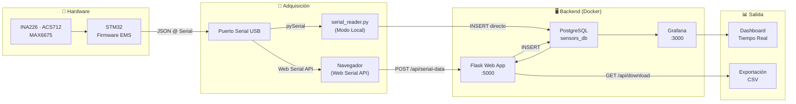
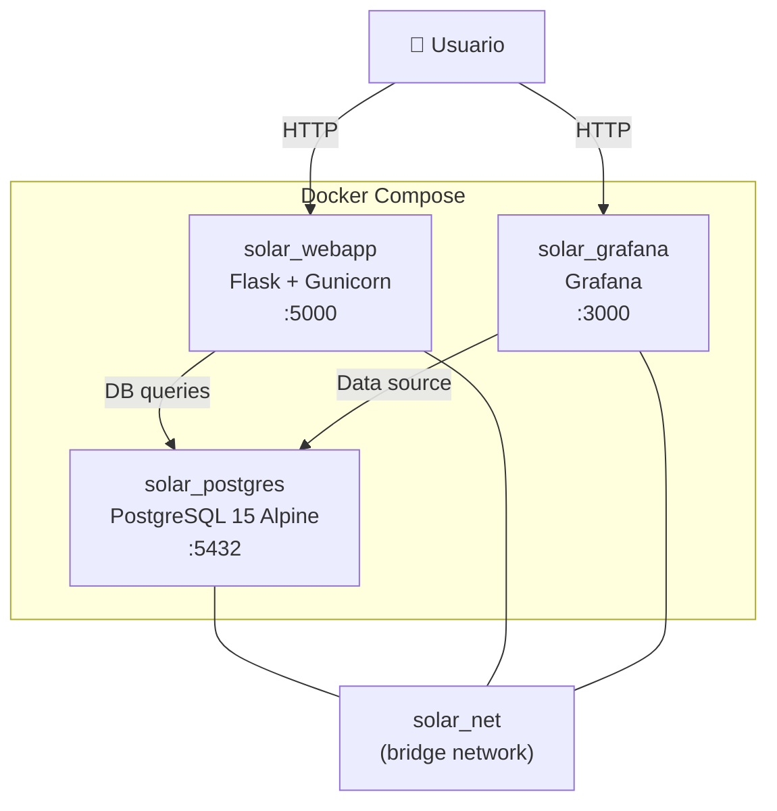

# Sistema EMS — Microgrid DC

El **Energy Management System (EMS)** para Microrredes DC es una plataforma de monitoreo, control y adquisición de datos diseñada para gestionar la energía proveniente de un panel fotovoltaico y una batería de respaldo hacia una carga resistiva.

## Visión General

El sistema se compone de tres capas principales:

| Capa | Componente | Tecnología |
|------|-----------|------------|
| **Hardware** | Prototipo DC-DC + sensores | STM32 + INA226 + ACS712 + MAX6675 |
| **Adquisición** | Lectura serial → Base de datos | Web Serial API (navegador) / `serial_reader.py` |
| **Visualización** | Dashboard en tiempo real | Grafana + Flask Web App |

## Flujo de Datos



## Modos de Adquisición de Datos

El sistema soporta **dos modos** de ingesta de datos desde el microcontrolador:

### 1. Modo Web (Recomendado para Producción)

El navegador del usuario establece una conexión directa con el puerto serial USB usando la **Web Serial API**. Los datos JSON se parsean en el cliente y se envían al servidor Flask vía `POST /api/serial-data`.

:::info Requisito
La Web Serial API requiere un **contexto seguro** (HTTPS o `localhost`). En producción, se requiere un proxy inverso con SSL (Nginx + Certbot).
:::

### 2. Modo Script (Ideal para Pruebas Locales)

El script `serial_reader.py` se ejecuta como proceso independiente (o contenedor Docker) y realiza la lectura serial + inserción directa en PostgreSQL, sin pasar por Flask.

## Esquema de Base de Datos

Todas las métricas se almacenan en **8 tablas independientes** con estructura idéntica:

```sql
CREATE TABLE IF NOT EXISTS <nombre_metrica> (
    id        SERIAL PRIMARY KEY,
    timestamp TIMESTAMP DEFAULT CURRENT_TIMESTAMP,
    value     FLOAT
);
CREATE INDEX IF NOT EXISTS idx_<nombre_metrica>_timestamp
    ON <nombre_metrica>(timestamp);
```

| Tabla | Descripción | Unidad |
|-------|------------|--------|
| `volt_panel` | Voltaje del panel fotovoltaico | V |
| `amp_panel` | Corriente del panel | A |
| `volt_bat` | Voltaje de la batería 3S | V |
| `amp_bat` | Corriente de la batería | A |
| `volt_load` | Voltaje del bus DC / carga | V |
| `amp_load` | Corriente de la carga | A |
| `temp_panel` | Temperatura del panel | °C |
| `temp_bat` | Temperatura de la batería | °C |

## Infraestructura Docker

El sistema completo se despliega con un solo comando usando Docker Compose:



:::tip Siguiente paso
Consulta la sección de [Despliegue Docker](./software/despliegue-docker) para instrucciones detalladas de cómo levantar el sistema.
:::
