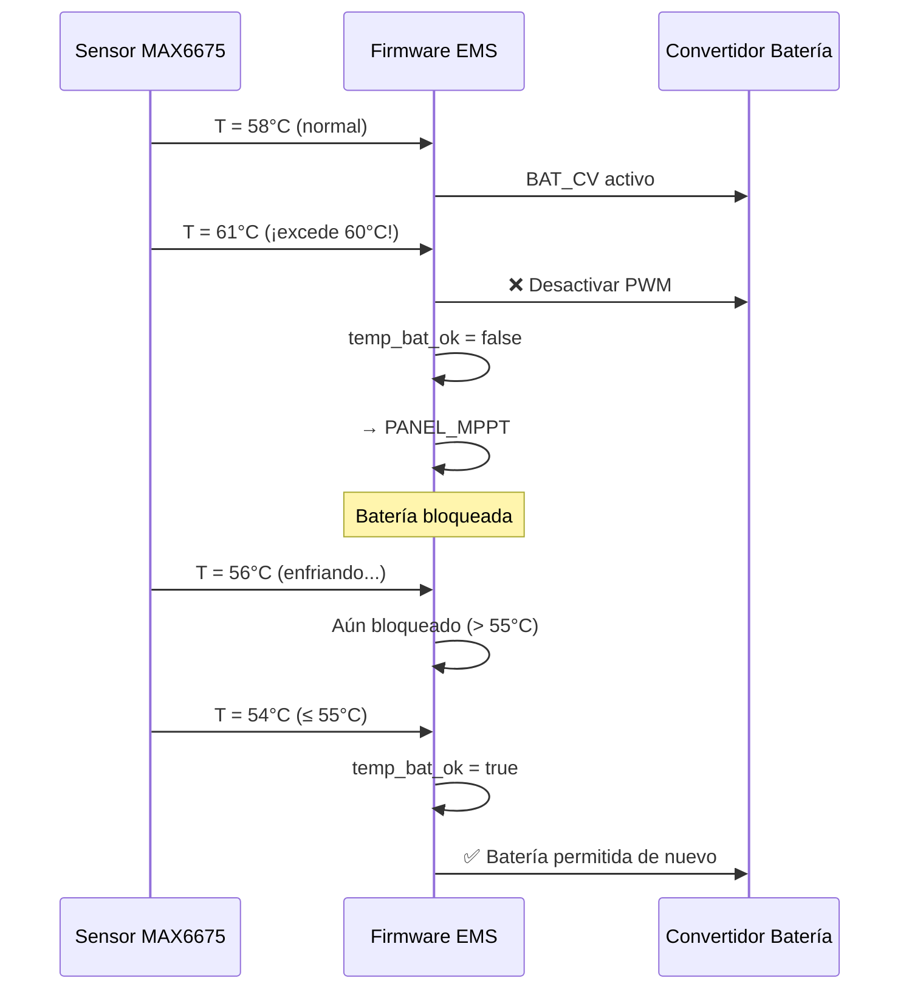

# Resultados Experimentales

Esta sección documenta los ensayos realizados sobre el prototipo EMS Microgrid DC bajo diferentes condiciones de carga y operación.

## Setup Experimental

El prototipo de pruebas consiste en una microrred DC modular:

- **Prototipo DC-DC**: Convertidores Buck (carga batería) y Boost (panel → carga).
- **Unidad de Control**: Microcontrolador STM32 ejecutando firmware EMS.
- **Carga de Validación**: Resistencia calibrada de **15 Ω**.
- **Fuentes**: Panel fotovoltaico y fuente de laboratorio de 24V.
- **Instrumentación**: Sensores INA226, ACS712 y MAX6675.

---

## Prueba A: Carga de Batería (Perfil CC/CV)

**Intervalo:** `2026-05-13 15:54:50` → `2026-05-13 16:24:24`

En este ensayo se evaluó el perfil de carga de la batería 3S Li-Ion utilizando la fuente de laboratorio fija de 24V como entrada.

### Resultados

El sistema STM32 reguló con éxito:
- **Etapa CC (Corriente Constante):** Corriente regulada a **1A**.
- **Etapa CV (Voltaje Constante):** Voltaje regulado a **12.6V**.
- **Eficiencia experimental:** **53.6%**.

### Gráficas

Las gráficas muestran la estabilización progresiva de la tensión (transición de CC a CV) y la reducción gradual de la corriente conforme la batería alcanza su voltaje nominal.

---

## Prueba B: Gestión de Energía a 15W

**Intervalo:** `2026-05-26 17:21:44` → `2026-05-26 17:45:31`

Ensayo bajo demanda de potencia de **15W** con el panel solar como fuente principal.

### Resultados

El panel solar suministró la potencia requerida de forma **prácticamente autónoma**. La intervención de la batería fue mínima, confirmando que la generación renovable cubrió el consumo en su totalidad.

### Gráfica

:::tip Observación
A 15W de demanda, el algoritmo MPPT mantuvo el punto de operación óptimo del panel sin necesidad de activar el modo `BAT_CV`, salvo en caídas momentáneas de irradiancia.
:::

---

## Prueba C: Gestión de Energía a 20W

**Intervalo:** `2026-05-25 18:40:53` → `2026-05-25 19:28:55`

Al incrementar el consumo a **20W**, se indujo una mayor dependencia de la batería ante variaciones de irradiancia solar.

### Resultados

El sistema de control activó la batería para **compensar dinámicamente** el déficit de potencia. La corriente de batería se ajustó para mantener constante el voltaje del bus DC de la carga.

### Gráfica

Se observa claramente la **conmutación automática** entre `PANEL_MPPT` y `BAT_CV`:
- Cuando la irradiancia es suficiente → Panel alimenta solo.
- Cuando la irradiancia cae → Batería entra como respaldo inmediato.

---

## Prueba D: Gestión de Energía a 25W (Alta Demanda)

**Intervalo:** `2026-05-26 18:17:32` → `2026-05-26 19:03:37`

Bajo condición de **alta demanda** (25W), el panel no puede sostener la carga por sí solo.

### Resultados

El sistema conmutó automáticamente al modo de respaldo de batería (`BAT_CV`) de forma **sostenida**. Se registraron corrientes de descarga pico de hasta **2.5A** suministradas por la batería para preservar la continuidad del servicio.

### Gráfica

:::warning Descarga Profunda
A 25W sostenidos, la batería se descarga significativamente. El sistema de protección (`VBAT_UNDERVOLTAGE = 9.50V`) eventualmente desactivará la salida si la batería llega al umbral crítico.
:::

---

## Prueba E: Protección Térmica de Batería

**Intervalo:** `2026-05-25 17:59:14` → `2026-05-25 18:10:00`

Se indujo un **calentamiento controlado** mediante pistola de calor sobre el sensor de temperatura de la batería (MAX6675) para validar el mecanismo de protección térmica.

### Resultados

| Evento | Temperatura | Acción del Sistema |
|--------|------------|-------------------|
| Calentamiento progresivo | 25°C → 60°C | Operación normal |
| Umbral superado | **≥ 60°C** | Desconexión inmediata de batería → `PANEL_MPPT` |
| Enfriamiento | 60°C → 55°C | Sistema bloqueado |
| Recuperación | **≤ 55°C** | Reanudación de operación normal |

### Gráficas

La histéresis de **5°C** (entre 60°C y 55°C) previene oscilaciones rápidas que podrían dañar la batería o los convertidores.

---

## Resumen Comparativo

| Prueba | Potencia | Fuente Dominante | Batería | Eficiencia |
|--------|----------|-----------------|---------|------------|
| Carga Batería | — | Fuente 24V | Cargando (CC/CV) | 53.6% |
| 15W | 15W | Panel Solar | Mínima intervención | Alta |
| 20W | 20W | Panel + Batería | Compensación dinámica | Media |
| 25W | 25W | Batería | Respaldo sostenido | — |
| Térmica | — | — | Protección validada | — |
