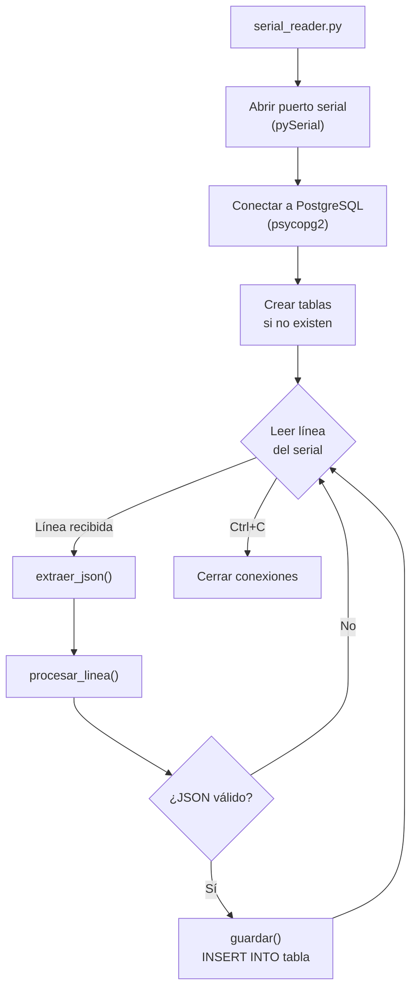

# Extracción y Procesamiento de Datos

El sistema ofrece dos vías para extraer y procesar los datos almacenados en PostgreSQL: la **interfaz web** y el **script Python** `serial_reader.py`.

## Extracción desde la Web

La interfaz web en el puerto `:5000` permite descargar datos en formato CSV directamente desde el navegador.

### Paso a Paso

1. Abrir `http://<ip-servidor>:5000` en un navegador.
2. En la sección **"Nodos de Almacenamiento"**, cada tabla muestra el conteo de filas y el tamaño en disco.
3. Configura la **ventana de extracción** con las fechas de inicio y fin.
4. Hacer clic en **"EXPORTAR RAW (.CSV)"**.

### Inyección de Rango desde Grafana

Si se está analizando un periodo específico en Grafana, se puede copiar el rango de tiempo directamente:

1. En Grafana, hacer clic en el selector de tiempo y copiar el JSON del rango (ej: `{"from":"2026-05-13T15:54:50.256Z","to":"2026-05-13T16:24:24.331Z"}`).
2. En la interfaz web, hacer clic en **"INYECTAR GRAFANA_JSON"** en la tarjeta de la tabla deseada.
3. Los campos de fecha se actualizarán automáticamente.

### API REST

La descarga se realiza internamente mediante el endpoint:

```
GET /api/download/<nombre_tabla>?start=<fecha_inicio>&end=<fecha_fin>
```

**Parámetros:**

| Parámetro | Formato | Ejemplo |
|-----------|---------|---------|
| `start` | `YYYY-MM-DD HH:mm:ss` | `2026-05-13 15:54:50` |
| `end` | `YYYY-MM-DD HH:mm:ss` | `2026-05-13 16:24:24` |

**Ejemplo con `curl`:**

```bash
curl -o volt_panel_data.csv \
  "http://localhost:5000/api/download/volt_panel?start=2026-05-13%2015:54:50&end=2026-05-13%2016:24:24"
```

El CSV resultante tiene el formato:

```csv
id,timestamp,value
1,2026-05-13 15:54:51.123456,18.432
2,2026-05-13 15:54:52.234567,18.501
...
```

---

## Extracción Nativa desde Grafana

Grafana ofrece una funcionalidad integrada para exportar los datos de cualquier gráfica directamente a un archivo CSV. Esto es útil si quieres exportar exactamente los mismos datos que estás visualizando, con el mismo rango de tiempo y resolución.

### Paso a Paso en Grafana

1. Abrir el panel de Grafana (`http://<ip-servidor>:3000`).
2. Ubica la gráfica de la cual deseas extraer los datos (ej: "Voltaje de Panel").
3. Hacer clic en el **título de la gráfica** para abrir el menú desplegable.
4. Selecciona **Inspect** > **Data**.
5. Se abrirá un panel lateral mostrando los datos en formato tabular.
6. Hacer clic en el botón **Download CSV**.

:::tip Opciones de Exportación
Al descargar desde Grafana, es posible habilitar "Data options" para aplicar transformaciones (por ejemplo, exportar la serie de tiempo formateada o extraer solo ciertos campos calculados).
:::

---

## Script Python: `serial_reader.py`

El script `serial_reader.py` es una herramienta standalone que puede ejecutarse fuera de Docker para leer datos del puerto serial e insertarlos directamente en PostgreSQL.

### Arquitectura del Script



### Configuración

El script se configura mediante **variables de entorno** o un archivo `.env`:

```bash
# Conexión Serial
SERIAL_PORT=/dev/ttyUSB0      # Puerto del microcontrolador
SERIAL_BAUDRATE=9600          # Velocidad del puerto serial

# Conexión a PostgreSQL
DB_HOST=localhost              # Host de la base de datos
DB_PORT=5432                   # Puerto de PostgreSQL
DB_NAME=sensors_db             # Nombre de la base de datos
DB_USER=postgres               # Usuario
DB_PASSWORD=postgres           # Contraseña

# Logging
LOG_LEVEL=INFO                 # Nivel de log (DEBUG, INFO, WARNING, ERROR)
```

### Ejecución Standalone

```bash
# Instalar dependencias
pip install pyserial psycopg2-binary python-dotenv

# Ejecutar el script
python backend/serial_reader.py
```

### Funciones Principales

#### `extraer_json(linea)`

Extrae el objeto JSON de una línea serial que puede contener ruido (bytes nulos, texto de arranque del microcontrolador, etc.):

```python
def extraer_json(self, linea):
    """Extrae el objeto JSON de una línea que puede traer ruido serial."""
    if not linea:
        return None

    # Limpiar bytes nulos y espacios
    limpia = linea.replace('\x00', '').strip()
    if not limpia:
        return None

    # Buscar las llaves del JSON
    ini = limpia.find('{')
    fin = limpia.rfind('}')
    if ini == -1 or fin == -1 or fin <= ini:
        return None

    return limpia[ini:fin + 1]
```

:::tip Robustez
Esta función es tolerante a líneas como `\x00\x00{"volt_panel":18.5}\r\n` que son comunes al iniciar la comunicación serial con microcontroladores STM32.
:::

#### `procesar_linea(linea)`

Parsea el JSON y filtra solo las **8 métricas válidas**, descartando campos como `mode`, `switching`, `pwm_panel`, etc. que el firmware envía pero que no se almacenan:

```python
metricas_validas = {
    'temp_panel', 'temp_bat', 'volt_panel', 'amp_panel',
    'volt_bat', 'amp_bat', 'volt_load', 'amp_load'
}

for metric, value in datos.items():
    if metric in metricas_validas and isinstance(value, (int, float)):
        self.guardar(metric, float(value), timestamp)
```

#### `guardar(metric, value, timestamp)`

Inserta un registro en la tabla correspondiente:

```python
def guardar(self, metric, value, timestamp):
    self.cursor.execute(
        f"INSERT INTO {metric} (timestamp, value) VALUES (%s, %s)",
        (timestamp, value)
    )
    self.conn.commit()
```

### Formato JSON del Microcontrolador

El STM32 envía una trama JSON por segundo con el siguiente formato:

```json
{
  "volt_panel": 19.234,
  "volt_panel_f": 19.180,
  "amp_panel": 1.456,
  "amp_panel_f": 1.420,
  "pow_panel": 27.236,
  "volt_load": 17.890,
  "volt_load_f": 17.850,
  "amp_load": 1.123,
  "volt_bat": 11.820,
  "volt_bat_f": 11.800,
  "amp_bat": 0.456,
  "amp_bat_f": 0.440,
  "temp_bat": 32.5,
  "temp_bat_ok": 1,
  "mode": "PANEL_MPPT",
  "switching": 0,
  "pwm_panel": 128,
  "pwm_bat": 0
}
```

:::info Nota
Solo se almacenan las 8 métricas principales (`volt_panel`, `amp_panel`, `volt_bat`, `amp_bat`, `volt_load`, `amp_load`, `temp_panel`, `temp_bat`). Los campos filtrados (`_f`) y de control (`mode`, `pwm_*`) son usados solo por el firmware para depuración.
:::
